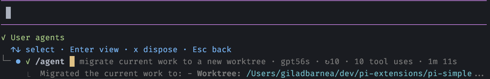
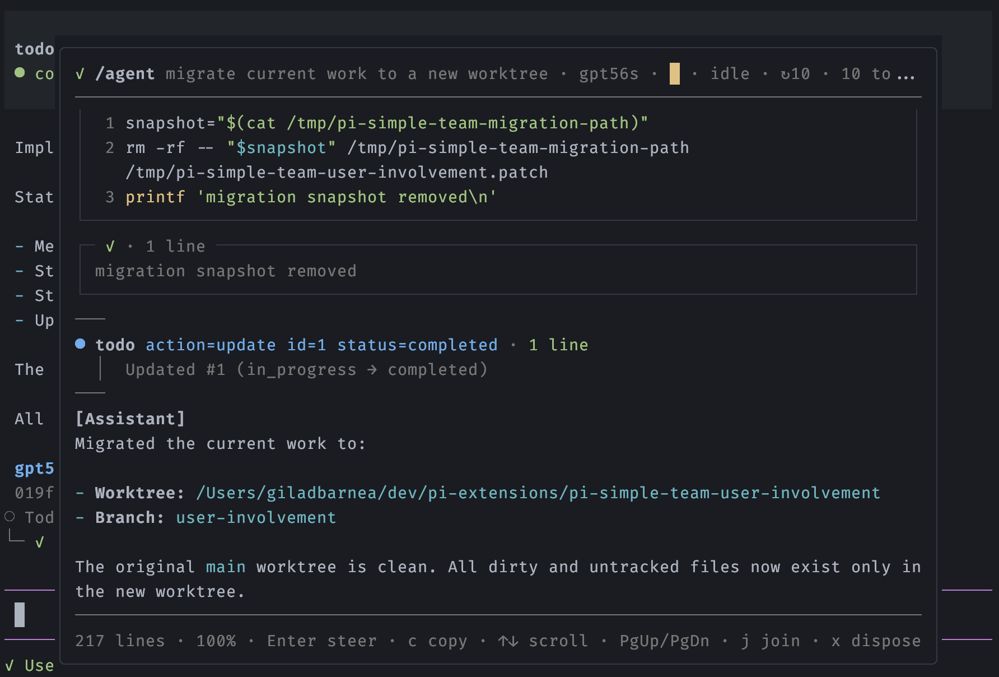

# pi-user-agents

> You deserve your own agents, too. It's only fair.

Pi extensions give your agent subagents. This one gives **you** — the user — your own: background agents you dispatch mid-turn, watch live, steer, and whose results stay **out of the main agent's context** until you decide otherwise.

The moment it's for: your main agent is deep in a tool-calling frenzy on phase 1, and you already know what phase 2 needs.

```
/agent plan the next phase and write it to phase-2.md
```

The instant you press Enter, a background agent forks off with a snapshot of the current conversation and gets to work — while your main agent keeps going, none the wiser.

## Install

```sh
pi install npm:@giladbarnea/pi-user-agents
```

## The loop

### 1. Dispatch

`/agent <task>` starts a background agent with the current conversation as its starting context — it knows everything the main agent knows up to that moment. `/agent -i <task>` starts one with a blank slate instead. Dispatch as many as you like; they run concurrently.

Classic dispatches:

```
/agent write a handoff document for the work currently in progress
/agent -i -m flash summarize what PARSER_SPEC.md guarantees
/agent -s --thinking high find the root cause of the flaky widget test
```

The first preserves the session's knowledge before the context window fills, without interrupting the main agent to do it. The second is a cheap, isolated errand. The third auto-squashes: its findings are delivered into the main conversation when it finishes.

### 2. Watch

Every agent gets a row in a widget under the editor: status, task, model, turn count, tool uses, elapsed time, a one-cell context meter, and the last line of live activity.

<a href="screenshots/below-editor-widget.png">
  
</a>

<div align="center"><em>The widget sits under the editor and stays out of your way.</em></div>

<br>

Press `←` or `↓` from the editor to focus the widget, pick an agent, press `Enter`, and its overlay opens: the full conversation, streaming live, following the tail as it grows. Scroll up to pause following; `End` resumes it. Tool calls render as proper views — `read`, `edit`, `write`, `grep`, `find`, `ls`, and `bash` each get a dedicated format, everything else a readable generic one.

<a href="screenshots/overlay.png">
  
</a>

<div align="center"><em>The overlay, over a main conversation that never paused.</em></div>

<br>

The context meter is the agent's own footer gauge in one cell: it fills `▁▂▃▄▅▆▇█` against that agent's model context window and shifts color through the same stages as Pi's footer (dim, then muted at 40%, warning at 65%, error at 85%).

### 3. Steer

A background agent is not fire-and-forget — it's a session you can talk to.

Press `Enter` in the overlay to open the steer composer. Mid-turn, your message queues in after the current tool batch, before the next model call — exactly like steering the main agent. After the turn completes, the same composer starts **another turn** on the same live session. Follow up as many times as you need; every completed turn posts its own result card.

`Ctrl+x` interrupts only the current turn — the agent goes idle and stays available for steering, squashing, or detaching. In fact, nothing ends an agent except you: pressing `d` twice, squashing or rebasing it, or ending the Pi session.

### 4. Detach

Every dispatched agent gets its own Pi session on disk, exactly like the one you're sitting in. When a row has served its purpose, press `d` twice: the agent stops, its row leaves the widget, and its session file is left untouched. The transcript records which one it was:

```
Detached session 0199c4f2-8b1a-7c3d-9e05-6a2f18d7b4ce
```

Pick it back up whenever you like — `/resume 0199c4f2`, or `pi -r` and choose it from the list. It resumes as an ordinary Pi session with its full history, its model, and its thinking level, and from there it is a normal agent you talk to directly.

### 5. Squash — or don't

This is what makes user agents different from subagents: **by default, the main agent never learns any of this happened.**

Each completed turn posts a result card into your transcript — metadata, a collapsed preview, expandable to the full Markdown response. The card is TUI-only: you read it, expand it, copy it, and the main agent's context is untouched. Ask an agent ten questions and your main agent's token budget doesn't move.

When a result does belong in the main conversation, squash it in:

- Dispatch with `-s`/`--squash` and the result is delivered automatically on completion.
- Or press `s` in the overlay of any completed agent, whenever you decide it earned its place.

A squash delivers a compact record, not a transcript dump: every message you sent the agent and the final answer to each — no thinking, no tool traffic. The record is rebuilt from the agent's full history at squash time, so early turns survive even after the agent compacts its own context. If the main agent is mid-turn, the record is steered in; if idle, it triggers a turn. A squashed agent retires; its overlay stays readable.

### 6. Or rebase — rewrite history

Squash has a raw sibling. Press `r` in the overlay and the agent's whole conversation — prompts, replies, tool calls and their results — is appended to the main session as ordinary messages, exactly as if you had prompted the main agent all along. The dispatch preamble is stripped, nothing is wrapped or summarized, and no trace remains that a background agent ever existed. Everything else the agent lived through rides along untouched — and if it compacted its own context mid-run, the compaction rides along too, so the main conversation's context picks up exactly where the agent's left off. The transcript redraws with the conversation inline, followed by one dim provenance line:

```
Rebased session 01a0534e-9fa7-7d6f-bd44-b85fba1f5e05 into this conversation (added 32 messages, ~135K tokens, 1 compaction event)
```

Rebase is a fast-forward, in the git sense: the child forked from the main conversation's tip, and its history can graft back only while that tip hasn't moved. Send the main agent anything after the dispatch and `r` disappears, leaving `s` — which always works — as the way in; press `r` anyway and the footer tells you why not, for a few seconds. Delivering the rebase switches the session in place — same file, same session id, transcript redrawn — so `r` is also withheld while any agent is mid-turn, and parked agents are detached first, each leaving its `Detached session …` line to `/resume` from. When siblings would be detached, the first `r` warns with the count and a second `r` confirms.

## Per-agent configuration

Each dispatch takes its own configuration, using the same flags as the `pi` CLI:

```
/agent -m opus --thinking high design the caching layer
/agent --tools read,grep,find audit the error handling in src/
/agent -i --system-prompt "be terse" what does the session-format doc guarantee?
```

Options come first; everything after them is your task, verbatim. The full grammar lives in [PARSER_SPEC.md](PARSER_SPEC.md) — not that you'll need it.

## The fanciest autocomplete in the Pi universe 

You'll rarely type any of this by hand. The moment you type `-`, a completion menu opens — no Tab needed. Anywhere the set of valid values is finite, the editor hands it to you: models, providers, thinking levels, the session's tools, even skill and prompt-template paths. You pick from what actually exists instead of typing and hoping.

And what you do type by hand is checked live, as you type. Valid options and values light up in your theme's syntax colors; anything that won't parse — a blocked option, a model that doesn't resolve, an option stranded after the task began — shows in the error color before you ever press Enter. A `/agent` line that looks right is right.

## Reference

Everything goes through one command: `/agent [options] <task>`.

| Flag | Effect |
|---|---|
| `-i`, `--isolate` | Start without the conversation snapshot |
| `-s`, `--squash` | Deliver the result into the main context on completion |
| `-m MODEL` | Model for this agent (alias of Pi's `--model`) |
| *pi CLI options* | Forwarded to the agent — `--thinking`, `--tools`, `--system-prompt`, … |

| Where | Key | Action |
|---|---|---|
| Editor | `←` / `↓` | Focus the agents widget |
| Widget | `↑` `↓` · `Enter` | Select an agent · open its overlay |
| Widget / overlay | `Ctrl+x` | Interrupt the current turn (agent stays alive) |
| Widget / overlay | `d` `d` | Detach the agent, keeping its session (twice to confirm) |
| Widget / overlay | `Esc` | Back |
| Overlay | `Enter` | Steer mid-turn, or start another turn when idle |
| Overlay | `s` | Squash the conversation into the main context |
| Overlay | `r` | Rebase the raw conversation into the main context (fast-forward only) |
| Overlay | `c` | Copy the latest response |
| Overlay | scroll · `End` | Pause tail-following · resume it |

## Good to know

- Every dispatch writes a real session file, so dispatched agents show up in `/resume` and `pi -r` alongside your own sessions. An agent that never answered leaves no file.
- Result cards persist across session reloads; the widget doesn't. After a reload you keep every card, and every agent's session is still on disk — but the steerable rows are gone. Reach them with `/resume`.
- Some accepted `pi` options have no effect on a background run (the session, approval, offline, and API-key families). They parse; they just don't do anything yet.
- `c` copies via `pbcopy`, so it's macOS-only for now.
- The overlay caps very large tool outputs and omits thinking entries.

## Under the hood

Design notes — result delivery through the Pi SDK, the squashed-message format, runtime sharing, model resolution, and editor internals — live in [INTERNALS.md](INTERNALS.md). The complete command grammar lives in [PARSER_SPEC.md](PARSER_SPEC.md).

---

Heavily inspired by [tintinweb/pi-subagents](https://github.com/tintinweb/pi-subagents).
